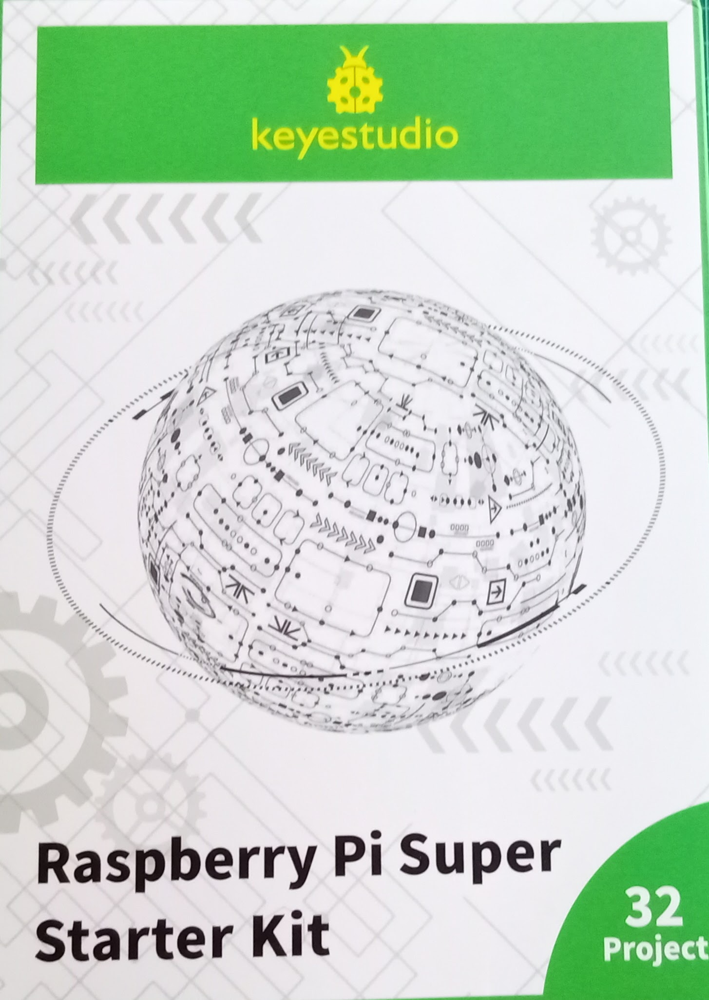
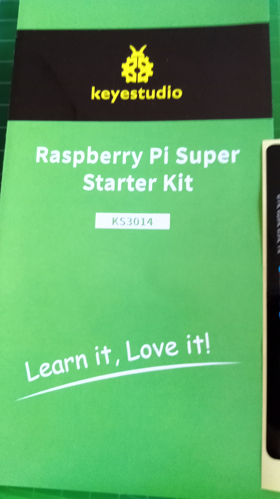
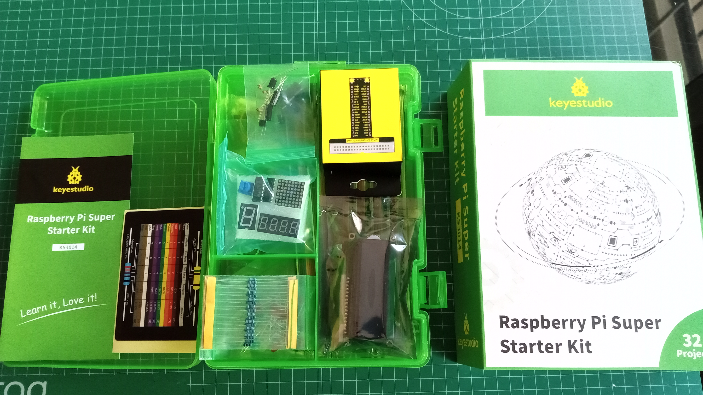
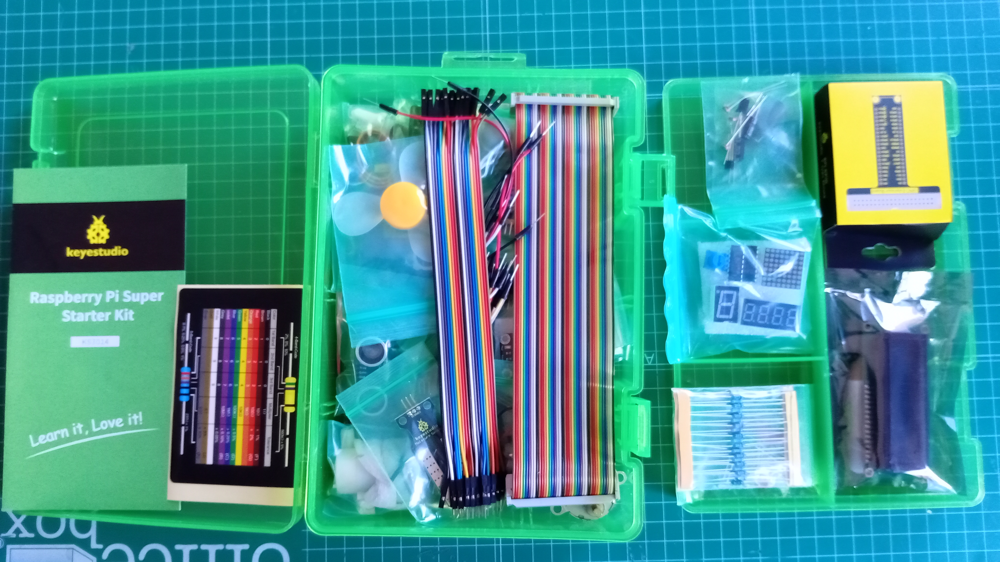
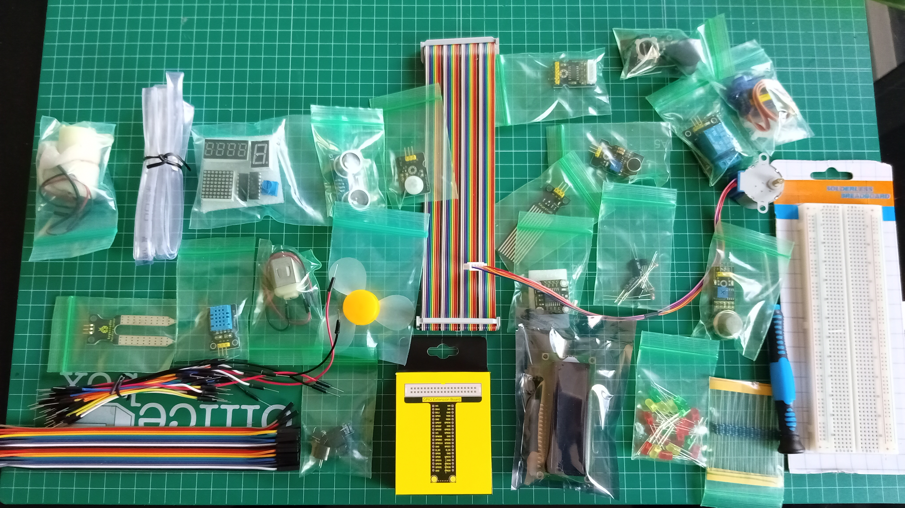
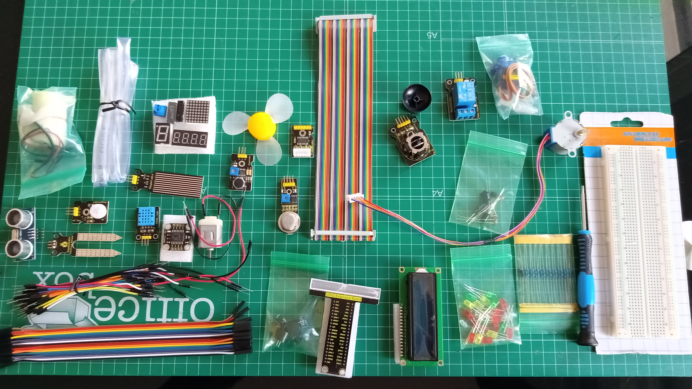

# Test Keyes Raspberry Pi Super Starter Kit

This is a very good Starter kit for learning to program and build electronic project with Raspberry Pi computer

There is a sheet of paper with the inventory and links to the full documentation

Include a good quality box that hold easyly all the components

You can find a [detailled inventory](https://wiki.keyestudio.com/KS3014_Raspberry_Pi_4B_Super_Starter_Kit) in the box and online.

You will find:
* GPIO board for Raspberry Pi, that make easier electrical connetions
* Digital sensors like motion sensors and switchs
* I2C ADC board with 4 analog input
* Analog sensors like LDR
* H-H and M-M wires
* Resistors
* Leds

In the documentation you will find a Raspberry Pi tutorial from starter to more complex projects

All the [examples & tutorials](https://fs.keyestudio.com/KS3014) are in python, java and C++, including all the code source in each languaje and very clear electrical schema for each one

32 projects, from 0 (blinking a led) to practical like plant-watering system

The documentation include chips & sensors DataSheets

